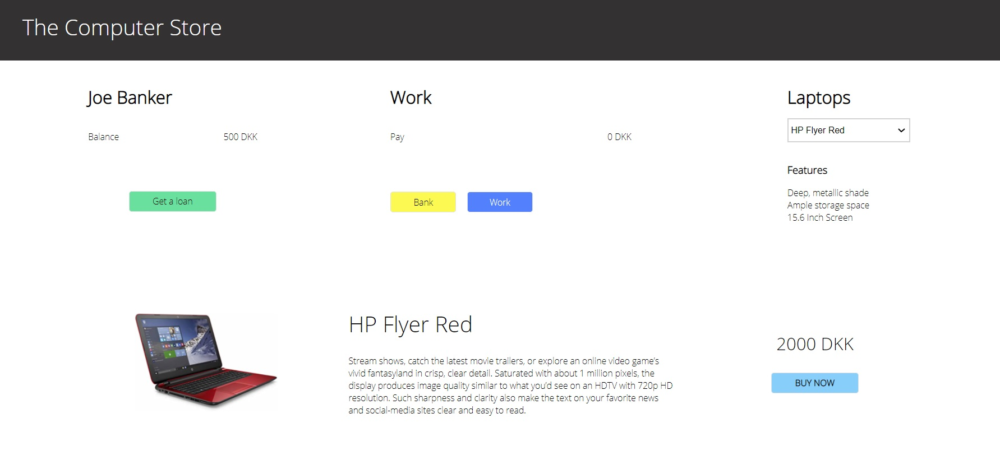

# This project is written with Vanilla JavaScript and custom created CSS (CSS Grid and Flexbox)

## The logic of the project is as follows:

- The program consists of three parts: bank balance, work balance and laptops.

- The laptop description, picture and price change according to the selection.

- When you click 'Get a loan' button, you may get a loan entering the sum in the prompt. The loan amount can't be more than double of a bank account.

- When you click 'Work' button, you receive 100 kr to your work acount.

- When you click 'Bank' button, 10% from the work account is transferred to pay for the loan, the rest is transferred to the bank account.

- When you choose a laptop model and click 'Buy now' button, you pay for it from the bank account.

- There are two hidden elements that appear only if you get a loan. An oustanding loan balace and 'Repay loan' button which transfers all the money from work account to bank account.

- Vanilla JavaScript and custom CSS with CSS Grid and Flexbox layout and media quieries (even though the project shows the best performance only for screens bigger than 900px now).

